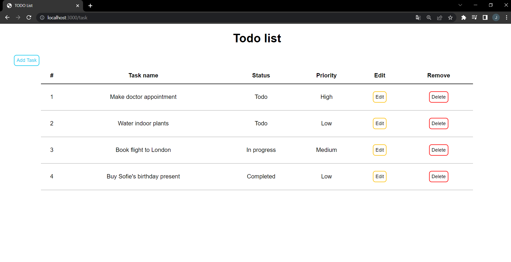
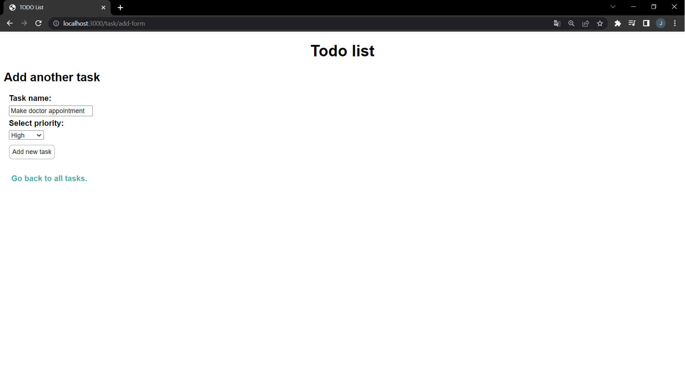
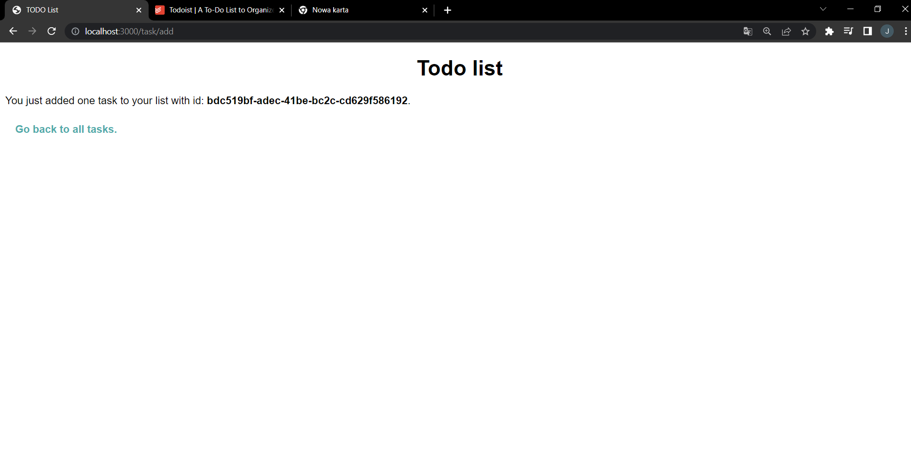

# Todo List

A simple application that will help you organize your daily tasks

## Table of contents
* [General info](#general-info)
* [Technologies](#technologies)
* [Setup](#setup)
* [Photos](#photos)
* [Contact](#contact)

## General info
Application for everyday use, you can:
* View all your tasks with assigned priority and status
* Add new task
* Delete task whether you have done it or not
* Edit (change task content, status and priority)
	
## Technologies
Project is created with:
* node: 16.4.2
* express: 4.18.1
* express-async-errors: 3.1.1
* express-handlebars: 6.0.6
* method-override: 3.0.0
* mysql2: 2.3.3
* uuid: 8.3.2
* typescript: 4.7.4
* npm: 8.12.1

## Setup
#### To run this project:

- Create SQL database: 
[Database SQL](./todo-databease-config.sql)

- Clone repository:
```
git clone https://github.com/kubea55/megak-zaliczenie.git
```
- Navigate to the project directory:
```
cd megak-zaliczenie
```
- Install all dependencies:
```
npm i
```
- Create a localhost port you should type:
```
ts-node index.ts
```
- Your Todo app is ready at port 3000.
```
http://localhost:3000
```

## Photos

### Main view of all tasks:


### View when you want to edit task:


### View when you want to add new task:


### View when you added task:


## Contact
k.burnatowski99@gmail.com
