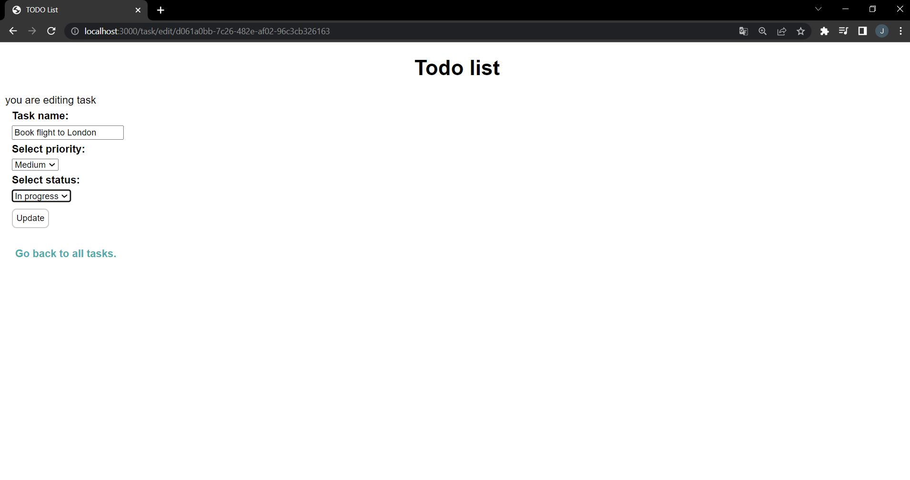

# Todo List

Simple todo application

## Table of contents
* [General info](#general-info)
* [Technologies](#technologies)
* [Setup](#setup)
* [Photos](#photos)

## General info
Application for everyday use, you can:
* View your tasks
* Add new task
* Delete task
* Edit task (change task, status and priority)
	
## Technologies
Project is created with:
* express: 4.18.1
* express-async-errors: 3.1.1
* express-handlebars: 6.0.6
* method-override: 3.0.0
* mysql2: 2.3.3
* uuid: 8.3.2
* typescript: 4.7.4
	
## Setup
To run this project, install it locally using npm:

Let's start with installing all dependencies. Move to the app main workspace and run:
```
git clone https://github.com/kubea55/megak-zaliczenie.git
```
```
npm init -y
npm i
```
To create a localhost port you should type:
```
ts-node index.ts
```
Your Todo app is ready at port 3000.
```
http://localhost:3000
```

## Photos

### Main view of all tasks:


### View when you want to edit task:


### View when you want to add new task:


### View when you added task:


